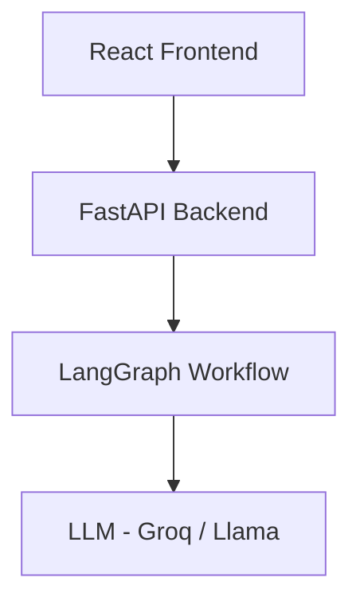

```markdown
# 🚀 Interviora — AI-Powered Interview Platform

**Interviora** is a full-stack AI application that transforms a Job Description into a complete mock interview experience using voice interaction and structured AI feedback. It simulates real interviews by generating questions, capturing spoken answers, and evaluating performance using LLMs.

---

## 🎯 Features

*   **📄 Job Description Analyzer**: Extracts role, skills, and responsibilities automatically.
*   **🤖 AI Interview Question Generator**: Generates role-specific interview questions.
*   **🎙️ Voice-Based Interview**: Answer questions using real-time speech recognition.
*   **🔄 Auto Question Flow**: Seamless progression between questions.
*   **🧠 AI Feedback System**: Provides a Score (0–100), Strengths, Areas for improvement, and a Final verdict.
*   **⚡ Multi-Agent Workflow**: Powered by **LangGraph** for structured AI pipelines.
*   **🌐 Full Stack Integration**: React frontend + FastAPI backend.

---

## 🏗️ Architecture Overview



### 🔄 Workflow
1. User inputs Job Description.
2. Backend triggers **LangGraph** workflow.
3. **JD Analyzer** extracts structured data.
4. **Question Generator** creates interview questions.
5. Frontend conducts voice-based interview.
6. Answers are sent to backend for evaluation.
7. AI generates and displays detailed feedback.

---

## 🧠 Tech Stack

| Layer | Technologies |
| :--- | :--- |
| **AI Layer** | LangChain, LangGraph, Groq (Llama models), Pydantic |
| **Backend** | FastAPI, Python, Dotenv |
| **Frontend** | React.js, Web Speech API (Speech Recognition) |

---

## 📂 Project Structure

```text
AI_CAREER_COACH/
│
├── ai_interview_backend/
│   ├── main.py
│   ├── interview_workflow.py
│
├── ai_interview_frontend/
│   ├── App.jsx
│   ├── JDInput.jsx
│   ├── Interview.jsx
│   ├── main.jsx
│   ├── App.css
│   ├── index.css
│
├── .env
└── testing1.py
```

---

## ⚙️ Setup Instructions

### 1️⃣ Clone Repository
```bash
git clone [https://github.com/your-username/interviora.git](https://github.com/your-username/interviora.git)
cd interviora
```

### 2️⃣ Backend Setup
```bash
cd ai_interview_backend
pip install -r requirements.txt
```
**Create a `.env` file:**
```env
GROQ_API_KEY=your_api_key
```
**Run server:**
```bash
uvicorn main:app --reload
```

### 3️⃣ Frontend Setup
```bash
cd ai_interview_frontend
npm install
npm run dev
```

---

## 🧪 API Endpoints

| Endpoint | Method | Description |
| :--- | :--- | :--- |
| `/start-interview` | `POST` | Initializes the session and generates questions. |
| `/submit-answer` | `POST` | Processes the user's spoken answer. |
| `/next-question` | `POST` | Fetches the next question in the queue. |
| `/generate-feedback` | `POST` | Triggers the final evaluation agent. |

---

## ⚠️ Challenges Faced

*   **Reliability**: Handling structured LLM outputs consistently.
*   **State Management**: Managing complex state across multi-agent workflows.
*   **Synchronization**: Debugging speech recognition timing and UI responsiveness.
*   **Logic**: Handling unpredictable or off-topic AI responses.

## 🧠 Key Learnings

*   Building AI apps requires robust **system design**, not just clever prompting.
*   **Structured outputs (Pydantic)** are critical for production reliability.
*   **LangGraph** enables scalable and maintainable multi-agent workflows.
*   Voice interaction adds a layer of real-world complexity to frontend state.

---

## 🚀 Future Improvements

*   📊 **Analytics Dashboard**: Visual progress tracking.
*   🗂️ **History Tracking**: Save and review past interview sessions.
*   🔐 **Authentication**: User accounts and profile management.
*   ☁️ **Cloud Deployment**: Vercel for frontend & Render/AWS for backend.
*   🎯 **Advanced Metrics**: Tone analysis and body language (video) integration.

---

## 🤝 Contributing
Feel free to fork the repository and submit pull requests!

## 📜 License
This project is open-source and available under the **MIT License**.

## 💡 Author
**Raghav Devgan**  
*Building AI-powered systems* 🚀
```
